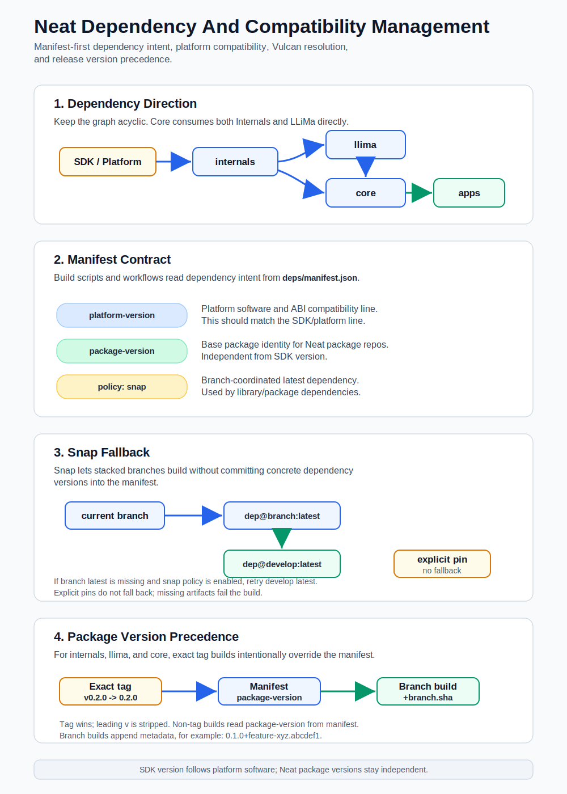

# Dependency And Compatibility Management

This is the living dependency and compatibility policy for the Neat repositories.
It captures the current contracts used by `internals`, `llima`, `core`, and `apps`
and should be updated whenever a new dependency-resolution scenario is added.



## Goals

- Keep repository package identity separate from SDK and platform software
  compatibility.
- Make `deps/manifest.json` the source of truth for inter-repository dependency
  intent.
- Let CI resolve branch, tag, and latest artifacts consistently through Vulcan.
- Preserve enough resolved metadata in build artifacts to reproduce what was
  built and tested.

## Repository Layers

The dependency direction is expected to stay acyclic:

```text
SDK / platform software -> internals
internals -> llima
internals -> core
llima -> core
core -> apps
```

`internals`, `llima`, and `core` produce Neat packages. Their package versions
are independent of the SDK release version.

`apps` consumes `core` artifacts and packages runnable examples or app bundles.

The Neat SDK image is different: its version should match the platform software
version it is built for. For example, an SDK image for platform `2.1.1` should
be identified as SDK `2.1.1`, while a Neat package inside that SDK can still be
versioned independently.

## `deps/manifest.json`

Every repository participating in the dependency graph should carry
`deps/manifest.json`. Workflows and build scripts should read dependency and
compatibility information from this file instead of hard-coding dependency
versions in CI.

### Common Fields

| Field | Applies to | Type | Meaning |
| --- | --- | --- | --- |
| `platform-version` | all repos | string | Platform software and ABI compatibility line. This should match the SDK/platform line the artifact is built and tested against. |
| `package-version` | package-producing repos | string | Base package identity for the repo. Used by Debian, CMake, and Python packaging where applicable. |

`platform-version` is not the Neat package version. It answers "which platform
software line is this compatible with?"

`package-version` is not the SDK version. It answers "what is the package
identity of this repository's artifact?"

### Dependency Fields

Dependency entries should use one of the following shapes.

These shapes apply to library/package dependencies such as `internals` and
`llima`. `apps` currently uses its own `neat_core` string contract, described
below.

| Shape | Meaning |
| --- | --- |
| `"dependency": {"policy": "snap"}` | Resolve to the matching branch/latest artifact when possible, with repository-specific fallback behavior. |
| `"dependency": {"branch": "name", "spec": "value"}` | Resolve a dependency from a named branch and artifact spec. Empty or omitted `spec` means latest for that branch when supported. |
| `"dependency": {"ref": "name", "spec": "value"}` | Same as `branch`, but for a general ref name. |
| `"dependency": "value"` | Explicit dependency spec. This is supported for compatibility, but object form is preferred for new pins. |

Only `policy: "snap"` is currently standardized. New policies should not be
introduced without updating this document and the repository validation scripts.

### Snap Fallback Behavior

`policy: "snap"` is the branch-coordination mode. It lets a repo consume a
matching dependency artifact from the same branch without committing a concrete
dependency version into `deps/manifest.json`.

For `llima -> internals`:

1. Resolve the current branch from GitHub PR context, GitHub ref context, or the
   local git branch.
2. Sanitize that branch into the Vulcan artifact branch key.
3. Try `internals@<current-branch>:latest`.
4. If that artifact cannot be resolved and snap fallback is enabled, retry
   `internals@develop:latest`.
5. If `develop:latest` also cannot be resolved, fail the build.

For `core -> internals` and `core -> llima`:

1. Resolve the current core branch from GitHub PR context, GitHub ref context,
   or the local git branch.
2. Try `<dependency>@<current-branch>:latest`.
3. If the branch is unavailable or cannot be determined, use `develop:latest`.
4. If Vulcan cannot resolve `<current-branch>:latest` and the dependency came
   from `policy: "snap"`, retry `<dependency>@develop:latest`.
5. If the dependency was explicitly pinned with a string, `branch`, `ref`, or
   `spec`, do not silently fall back; failing to resolve that explicit artifact
   is a build error.

This behavior is intended to make stacked branches work naturally while still
allowing a feature branch to build against the latest compatible `develop`
dependency when no matching branch artifact exists yet.

### SDK Dependency

`internals` currently declares the SDK channel:

```json
{
  "sdk": {
    "channel": "main"
  },
  "package-version": "0.1.0",
  "platform-version": "2.0.0"
}
```

`sdk.channel` identifies the SDK image/channel used to build the lower-level
packages. The SDK image version should still match the platform software line.

### Internals Dependency

`llima` declares `internals`:

```json
{
  "internals": {
    "policy": "snap"
  },
  "package-version": "0.1.0",
  "platform-version": "2.0.0"
}
```

With `policy: "snap"`, `llima/build.sh` resolves an internals artifact from the
current branch when possible, then falls back to `develop:latest` if the snap
policy allows it.

### Core Dependencies

`core` declares both `internals` and `llima`:

```json
{
  "internals": {
    "policy": "snap"
  },
  "llima": {
    "policy": "snap"
  },
  "package-version": "0.1.0",
  "platform-version": "2.0.0"
}
```

The `core` build resolves these dependencies through `sima-cli neat install`
and writes a resolved dependency manifest under `build/resolved_manifest.json`.
The Vulcan CI job copies this into the published distribution as
`dist/resolved-deps-manifest.json`.

### Apps Core Dependency

`apps` `develop` currently uses a simplified manifest contract:

```json
{
  "neat_core": "",
  "platform-version": "2.0.0"
}
```

`neat_core` must be a string.

- Empty string means auto-resolve the core artifact from the dependency branch
  and use `latest`.
- `apps` does not currently define `package-version` in its manifest. Its
  package version is supplied by CI when `sima-cli packages build` creates the
  Vulcan package.
- On `main` and `develop`, `neat_core` must stay empty so protected branches do
  not pin stale core artifacts.
- Feature branches can use an explicit `branch-version` value, for example
  `feature-branch-abcdef1`.
- The branch portion may contain hyphens. The resolver treats the final hyphen
  segment as the artifact version.
- `--neat-core-version <branch-version>` can override the manifest for one
  local build.

When `NEAT_CORE_INSTALL_MODE=vulcan`, `apps/build.sh` installs core with:

```text
core@<branch>:<version>
```

and records the resolved core target in `deps/.neat_core`.

## Versioning Policy

Neat packages and the SDK are versioned for different purposes.

Neat package repositories:

- Use `package-version` as the base version for package artifacts.
- Use `platform-version` to express platform and ABI compatibility.
- May produce branch builds with branch and short-SHA metadata.
- May use an exact release tag to override `package-version`; this is an
  intentional release mechanism. Release owners must ensure the tag value is the
  intended package version.

### Package Version Precedence

For package-producing repositories such as `internals`, `llima`, and `core`,
the package version is resolved in this order:

1. Exact release tag wins.
   - In GitHub Actions, `GITHUB_REF_TYPE=tag` and `GITHUB_REF_NAME` provide the
     tag version.
   - In local builds, an exact `git describe --tags --exact-match` tag provides
     the tag version.
   - A leading `v` is stripped, so `v0.2.0` becomes `0.2.0`.
2. If the build is not on an exact tag, read `package-version` from
   `deps/manifest.json`.
3. For branch builds, append sanitized branch and short SHA metadata:
   `package-version+branch.shortsha`.

Examples:

```text
tag v0.2.0             -> 0.2.0
manifest 0.1.0 on main -> 0.1.0+main.abcdef123456
manifest 0.1.0 on feature/xyz -> 0.1.0+feature-xyz.abcdef123456
```

This tag-over-manifest behavior is intentional for releases. It lets release
tags define the published package version without requiring a manifest-only
version bump commit.

`apps` is the current exception. Its `develop` manifest does not define
`package-version`; CI passes the package version to `sima-cli packages build`
from the build context.

SDK releases:

- Should match the platform software version they are built for.
- Provide the build container, target sysroot, and cross-compilation environment
  for that platform line.
- Should not force Neat package repositories to share the SDK version as their
  own package version.

Example:

```text
platform-version: 2.1.1
SDK version:      2.1.1
core package:     0.1.0+feature-xyz.abcdef1
llima package:    0.1.0+feature-xyz.abcdef1
internals pkg:    0.1.0+feature-xyz.abcdef1
```

## CMake And Package Compatibility

CMake package compatibility should follow `platform-version`.

`llima` reads both `platform-version` and `package-version` from its manifest.
It uses `platform-version` when finding `NeatInternals` with CMake, and it uses
`package-version` to derive Debian dependency bounds for internals packages.

`core` reads both fields as well. It uses `platform-version` when finding
`SimaLMM` and `NeatInternals`, and its installed CMake config should preserve
those platform-version requirements for downstream consumers:

```cmake
find_dependency(SimaLMM <platform-version> CONFIG REQUIRED)
find_dependency(NeatInternals <platform-version> CONFIG REQUIRED)
```

This prevents downstream builds from accidentally mixing packages from
different platform lines even when package names are resolvable.

## Vulcan CI Behavior

The repositories use the shared `.github` Vulcan workflows to run builds inside
an SDK container, publish artifacts, and update latest aliases where supported.

Common behavior:

- `vulcan-resolve-config.yml` resolves the Vulcan environment and artifact base
  URL.
- Build jobs install or refresh `sima-cli` inside the SDK container.
- Branch builds publish branch/SHA-addressable artifacts.
- Branch builds may also publish or promote `latest` aliases.
- Tag builds use the tag as the release version input where the repo packaging
  script supports tag override.

Current workflow defaults are not fully uniform:

- `core` defaults `VULCAN_ENV` to `production`.
- `internals`, `llima`, and `apps` currently default `VULCAN_ENV` to `dev`
  unless the repository variable overrides it.

The intended policy for long-lived shared dependency resolution is to use the
production Vulcan environment unless a branch or workflow is explicitly testing
against another environment.

## Development Rules

1. Add or change inter-repository dependencies in `deps/manifest.json` first.
2. Keep workflow hard-coded dependency versions out of CI unless they are
   temporary diagnostics.
3. Keep `main` and `develop` manifests generic:
   - use `policy: "snap"` for library dependencies;
   - keep `apps/deps/manifest.json` `neat_core` empty.
4. Use explicit branch/spec pins only on feature branches, bug reproductions, or
   temporary integration tests.
5. When changing platform compatibility, update `platform-version` in every
   repo that is intentionally moving to that platform line.
6. When changing SDK platform support, align the SDK image version with the
   platform software version and keep cross-compilation runtime compatibility in
   scope.
7. Publish resolved dependency metadata with build artifacts so downstream
   failures can be traced to exact dependency inputs.
8. If a new manifest shape or resolver policy is needed, update this document,
   add validation in the affected repo, and add tests for the resolver behavior.

## Current Validation Coverage

- `core/scripts/ci/check_artifacts.sh` validates that `deps/manifest.json`
  exists, that `platform-version` and `package-version` are non-empty, and that
  the `internals` dependency uses a supported shape.
- `llima/build.sh` validates the `internals` dependency shape before resolving
  through Vulcan.
- `apps/tests/scripts/test_manifest_contract.py` covers empty, explicit, and
  protected-branch `neat_core` behavior.

As this policy becomes stricter, each repository should converge on shared
schema validation so unsupported manifest content fails early.
