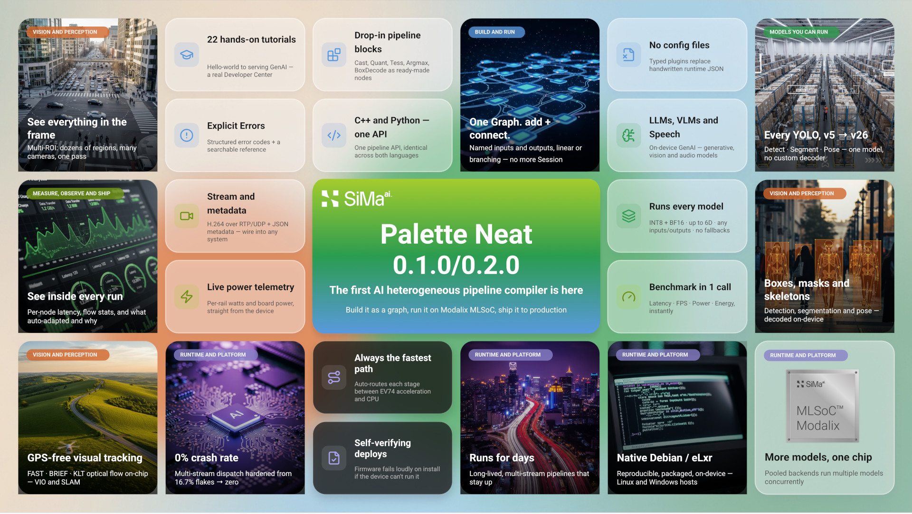

# SiMa.ai Neat

  

<picture>
  <source media="(prefers-color-scheme: dark)" srcset="./ga-dark.jpg" />
  <source media="(prefers-color-scheme: light)" srcset="./ga-light.jpg" />
  
</picture>

**SiMa.ai Neat** is an application-development framework for building and running AI applications on the SiMa.ai platform. It provides Python and C++ APIs for working with compiled model artifacts, composing application logic, and running AI pipelines on Modalix DevKits and SiMa.ai SoCs.

Neat sits at the application layer of the SiMa.ai software stack. It uses GStreamer-based execution underneath while giving developers a higher-level model for building, testing, and maintaining edge AI applications.

## Start Here

- **Documentation:** [developer.sima.ai](https://developer.sima.ai)
- **Neat Library:** [core](https://github.com/sima-neat/core)
- **Neat Development Environment:** [sdk](https://github.com/sima-neat/sdk)
- **Model compilation:** [model-compiler](https://github.com/sima-neat/model-compiler)
- **Examples and applications:** [apps](https://github.com/sima-neat/apps)

## What Neat Provides

- A Python and C++ programming model for composing AI applications
- A `Model`, `Graph`, and `Run` workflow for moving from compiled model package to runtime execution
- Reusable application patterns for object detection, segmentation, tracking, depth estimation, and related edge AI workloads
- Neat Development Environment and Model Compiler tooling for building against SiMa.ai targets
- Diagnostics and workflow tools for validating pipelines and inspecting application behavior

## Repository Map

| Repository | Purpose |
| --- | --- |
| [core](https://github.com/sima-neat/core) | Neat Library APIs, tutorials, and documentation source |
| [sdk](https://github.com/sima-neat/sdk) | Neat Development Environment for integrated application development and cross-compilation |
| [model-compiler](https://github.com/sima-neat/model-compiler) | Model Compiler tooling for preparing models for SiMa.ai hardware |
| [apps](https://github.com/sima-neat/apps) | Example applications and reference pipeline patterns |
| [sima-cli](https://github.com/sima-neat/sima-cli) | Developer utilities for setup, assets, and workflow automation |
| [insight](https://github.com/sima-neat/insight) | Runtime inspection, media routing, and interactive testing for Neat applications |
| [llima](https://github.com/sima-neat/llima) | Runtime and compile-time tooling for LLM and VLM workloads |
| [playbooks](https://github.com/sima-neat/playbooks) | Coding-agent playbooks for common Neat development workflows |

Private repositories support internal integrations, build infrastructure, model assets, and fleet-based test execution.

## Development Model

Neat is designed for teams building production AI applications at the edge:

- Build and validate application behavior close to the target runtime
- Keep model packages, application composition, and runtime execution as separate concerns
- Reuse tested application patterns instead of hand-maintaining brittle pipelines
- Support both direct developer workflows and agent-assisted development

For installation, build steps, tutorials, and API references, use the current docs at [developer.sima.ai](https://developer.sima.ai).
